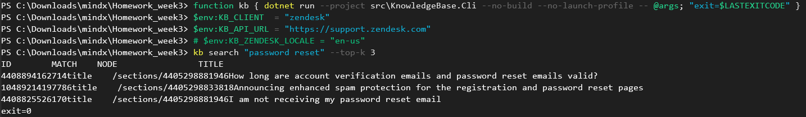
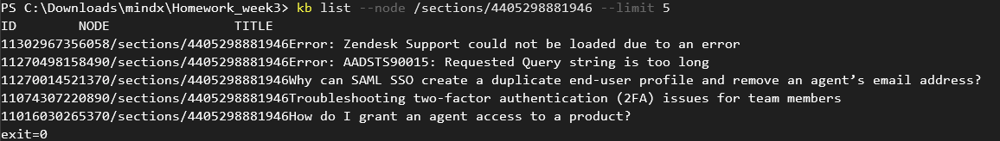
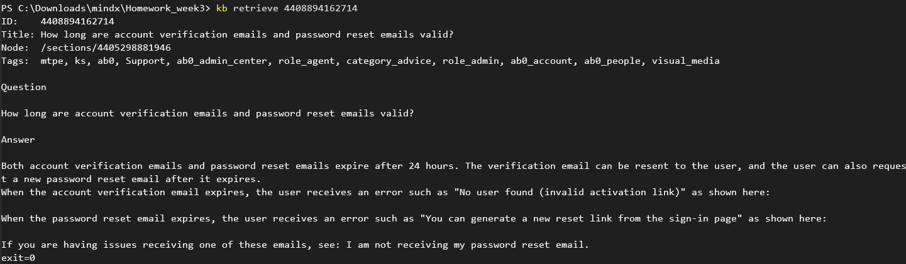
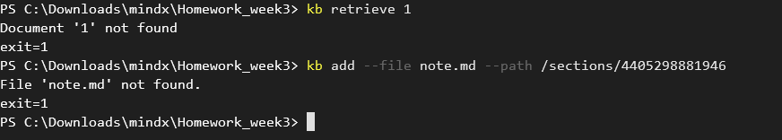
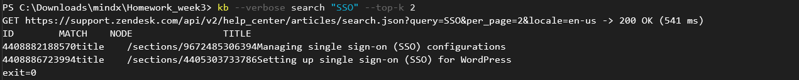

# Bằng chứng kiểm thử tích hợp với Zendesk Help Center

CLI `kb` chạy thật với một Knowledge Base **bên ngoài**: [Zendesk Help Center](https://developer.zendesk.com/api-reference/help_center/help-center-api/) của Zendesk tại `https://support.zendesk.com`. Đây là KB đang chạy production, do một bên thứ ba vận hành. Mọi request đi qua Internet tới server của Zendesk; phía server không có code nào của project.

## Thông tin lần chạy

<!-- Điền khi chụp ảnh: ngày giờ chạy, và commit lấy bằng lệnh `git rev-parse --short HEAD` -->

| | |
|---|---|
| KB | `https://support.zendesk.com` |
| Client | `KB_CLIENT=zendesk`, `KB_ZENDESK_LOCALE` mặc định (`en-us`) |
| Token | Không dùng (Help Center công khai) |
| Mã nguồn | commit `<commit>` |
| Terminal | `<PowerShell / Git Bash>` |

Cấu hình trước khi chạy (PowerShell):

```powershell
cd C:\Downloads\mindx\Homework_week3
dotnet build
function kb { dotnet run --project src\KnowledgeBase.Cli --no-build --no-launch-profile -- @args; "exit=$LASTEXITCODE" }
$env:KB_CLIENT  = "zendesk"
$env:KB_API_URL = "https://support.zendesk.com"
```

## Tóm tắt

| # | Bước | Lệnh | Mong đợi | Kết quả |
|---|---|---|---|---|
| 1 | Tìm kiếm | `kb search "password reset" --top-k 3` | exit 0; 3 bài, cột MATCH | `<PASS / FAIL>` |
| 2 | Liệt kê section | `kb list --node /sections/4405298881946 --limit 5` | exit 0; các bài trong section | `<PASS / FAIL>` |
| 3 | Xem chi tiết | `kb retrieve 4408894162714` | exit 0; nội dung là chữ, không còn thẻ HTML | `<PASS / FAIL>` |
| 4 | Bài không tồn tại | `kb retrieve 1` | exit 1; `Document '1' not found` | `<PASS / FAIL>` |
| 5 | Thêm bài (chỉ đọc) | `kb add --file note.md --path /sections/4405298881946` | exit 1; `Zendesk Help Center is read-only...` | `<PASS / FAIL>` |
| 6 | Log request | `kb --verbose search "SSO" --top-k 2` | stderr có `GET https://support.zendesk.com/api/v2/help_center/... -> 200 OK` | `<PASS / FAIL>` |
| 7 | Bộ test tự động | `dotnet test` | 191/191 pass (trong đó 55 lượt cho Zendesk) | `<PASS / FAIL>` |

## Chi tiết

### 1. Tìm kiếm

```
kb search "password reset" --top-k 3
```

<!-- ẢNH: đặt vào docs/images/zendesk-search.png -->


### 2. Liệt kê bài viết trong một section

Section `4405298881946` lấy từ cột `NODE` của bước 1.

```
kb list --node /sections/4405298881946 --limit 5
```

<!-- ẢNH: đặt vào docs/images/zendesk-list.png -->


### 3. Xem chi tiết một bài viết

Id `4408894162714` lấy từ cột `ID` của bước 1. Bài viết gốc là HTML; CLI hiển thị dạng chữ.

```
kb retrieve 4408894162714
```

<!-- ẢNH: đặt vào docs/images/zendesk-retrieve.png -->


Đối chiếu với bài gốc trên web: https://support.zendesk.com/hc/en-us/articles/4408894162714

### 4–5. Các trường hợp lỗi

```
kb retrieve 1
kb add --file note.md --path /sections/4405298881946
```

<!-- ẢNH: đặt vào docs/images/zendesk-errors.png (thấy được cả 2 lệnh và dòng exit=1) -->


### 6. Log request tới Zendesk

`--verbose` in ra stderr URL thật mà CLI đã gọi, chứng minh request đi tới `support.zendesk.com`.

```
kb --verbose search "SSO" --top-k 2
```

<!-- ẢNH: đặt vào docs/images/zendesk-verbose.png -->


